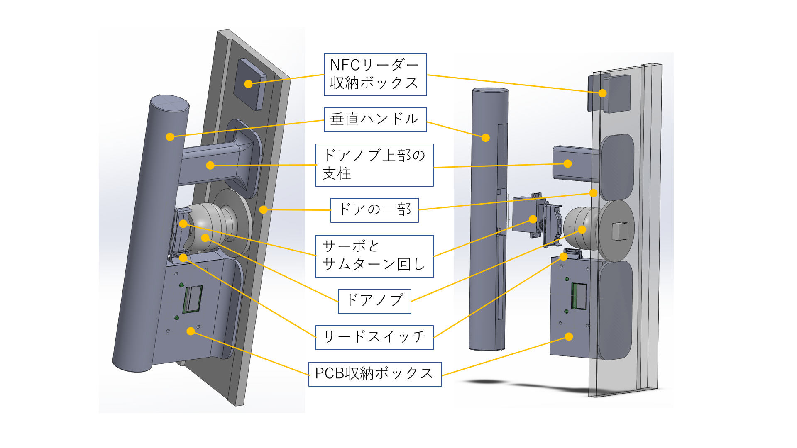
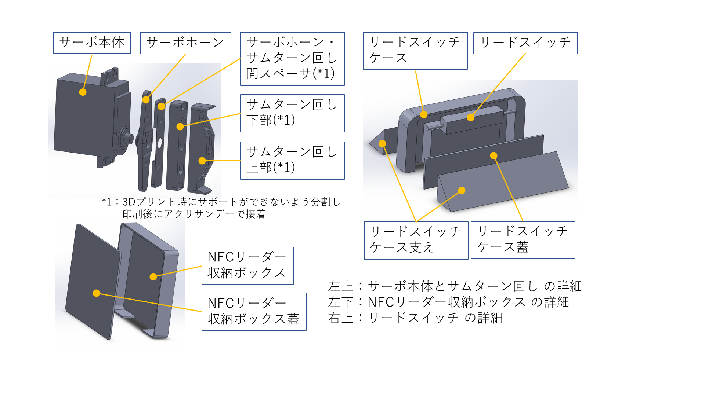
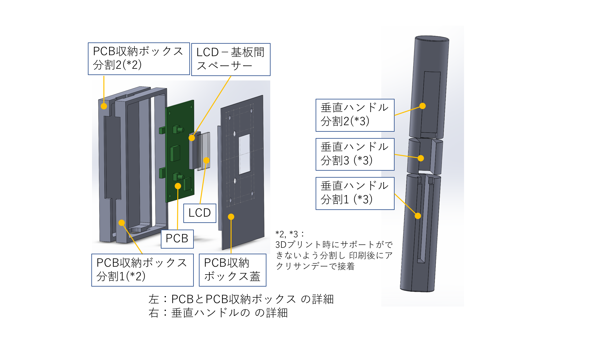

# Smart Door Keyper 3Dプリントファイル

* SOLIDWORKS 2017で設計
* 3Dプリンタで出力する際に，サポート材が生成されないように分割ししてSTLにしている部品がある

## 分解図（組み立てイメージ）

## ファイル一覧

<table>
  <tr>
    <th colspan="3">SolidWorks2017で作成した図面</th>
    <th colspan="2">3Dプリンタ用STLファイル</th>
  </tr>
  <tr>
    <td><a href="Solidworks/AssemDoorAndServo.SLDASM">AssemDoorAndServo.SLDASM</a>
    <td>組立図</td>
    <td>全組立図</td>
    <td></td>
    <td></td>
  </tr>
  <tr>
    <td><a href="Solidworks/AssemDoorKnob.SLDASM">AssemDoorKnob.SLDASM</a>
    <td>組立図</td>
    <td>ドアノブ</td>
    <td></td>
    <td></td>
  </tr>
  <tr>
    <td><a href="Solidworks/AssemNfcBox.SLDASM">AssemNfcBox.SLDASM</a>
    <td>組立図</td>
    <td>NFCリーダー収納ボックス</td>
    <td></td>
    <td></td>
  </tr>
  <tr>
    <td><a href="Solidworks/AssemPrintCircuitBoardAndLid.SLDASM">AssemPrintCircuitBoardAndLid.SLDASM</a>
    <td>組立図</td>
    <td>基板と基板収納ボックスの蓋</td>
    <td></td>
    <td></td>
  </tr>
  <tr>
    <td><a href="Solidworks/AssemPrintCircuitBoardBox.SLDASM">AssemPrintCircuitBoardBox.SLDASM</a>
    <td>組立図</td>
    <td>基板収納ボックスと基板</td>
    <td></td>
    <td></td>
  </tr>
  <tr>
    <td><a href="Solidworks/AssemPrintCuircuitBoard.SLDASM">AssemPrintCuircuitBoard.SLDASM</a>
    <td>組立図</td>
    <td>PCB</td>
    <td></td>
    <td></td>
  </tr>
  <tr>
    <td><a href="Solidworks/AssemReedSwitchCase.SLDASM">AssemReedSwitchCase.SLDASM</a>
    <td>組立図</td>
    <td>リードスイッチとケース</td>
    <td></td>
    <td></td>
  </tr>
  <tr>
    <td><a href="Solidworks/AssemServo.SLDASM">AssemServo.SLDASM</a>
    <td>組立図</td>
    <td>サーボとサムターン回し</td>
    <td></td>
    <td></td>
  </tr>
  <tr>
    <td><a href="Solidworks/door.SLDPRT">door.SLDPRT</a>
    <td>部品図</td>
    <td>ドア（の一部）</td>
    <td></td>
    <td></td>
  </tr>
  <tr>
    <td rowspan="3"><a href="Solidworks/HandleVertical.SLDPRT">HandleVertical.SLDPRT</a>
    <td rowspan="3">部品図</td>
    <td rowspan="3">垂直ハンドル</td>
    <td><a href="STL/HandleVertical1.STL">HandleVertical1.STL</a>
    <td>垂直ハンドル分割1</td>
  </tr>
  <tr>
    <td><a href="STL/HandleVertical2.STL">HandleVertical2.STL</a>
    <td>垂直ハンドル分割2</td>
  </tr>
  <tr>
    <td><a href="STL/HandleVertical3.STL">HandleVertical3.STL</a>
    <td>垂直ハンドル分割3</td>
  </tr>
  <tr>
    <td><a href="Solidworks/Knob.SLDPRT">Knob.SLDPRT</a>
    <td>部品図</td>
    <td>ドアノブ</td>
    <td></td>
    <td></td>
  </tr>
  <tr>
    <td><a href="Solidworks/KnobUpper.SLDPRT">KnobUpper.SLDPRT</a>
    <td>部品図</td>
    <td>ドアノブ上部の支柱</td>
    <td><a href="STL/KnobUpper.STL">KnobUpper.STL</a>
    <td>ドアノブ上部の支柱</td>
  </tr>
  <tr>
    <td><a href="Solidworks/LCD.SLDPRT">LCD.SLDPRT</a>
    <td>部品図</td>
    <td>LCD</td>
    <td></td>
    <td></td>
  </tr>
  <tr>
    <td><a href="Solidworks/LcdSpacer.SLDPRT">LcdSpacer.SLDPRT</a>
    <td>部品図</td>
    <td>LCD－基板間スペーサー</td>
    <td><a href="STL/LcdSpacer.STL">LcdSpacer.STL</a>
    <td>LCD－基板間スペーサー</td>
  </tr>
  <tr>
    <td><a href="Solidworks/NfcBox.SLDPRT">NfcBox.SLDPRT</a>
    <td>部品図</td>
    <td>NFCリーダー収納ボックス</td>
    <td><a href="STL/NfcBox.STL">NfcBox.STL</a>
    <td>NFCリーダー収納ボックス</td>
  </tr>
  <tr>
    <td><a href="Solidworks/NfcBoxLid.SLDPRT">NfcBoxLid.SLDPRT</a>
    <td>部品図</td>
    <td>NFCリーダー収納ボックス蓋</td>
    <td><a href="STL/NfcBoxLid.STL">NfcBoxLid.STL</a>
    <td>NFCリーダー収納ボックス蓋</td>
  </tr>
  <tr>
    <td><a href="Solidworks/PrintCircuitBoard.SLDPRT">PrintCircuitBoard.SLDPRT</a>
    <td>部品図</td>
    <td>PCB</td>
    <td></td>
    <td></td>
  </tr>
  <tr>
    <td rowspan="2"><a href="Solidworks/PrintCircuitBoardBox.SLDPRT">PrintCircuitBoardBox.SLDPRT</a>
    <td rowspan="2">部品図</td>
    <td rowspan="2">PCB収納ボックス</td>
    <td><a href="STL/PrintCircuitBoardBox1.STL">PrintCircuitBoardBox1.STL</a>
    <td>PCB収納ボックス分割1</td>
  </tr>
  <tr>
    <td><a href="STL/PrintCircuitBoardBox2.STL">PrintCircuitBoardBox2.STL</a>
    <td>PCB収納ボックス分割2</td>
  </tr>
  <tr>
    <td><a href="Solidworks/PrintCircuitBoardLid.SLDPRT">PrintCircuitBoardLid.SLDPRT</a>
    <td>部品図</td>
    <td>PCB収納ボックス蓋</td>
    <td><a href="STL/PrintCircuitBoardLid.STL">PrintCircuitBoardLid.STL</a>
    <td>PCB収納ボックス蓋</td>
  </tr>
  <tr>
    <td><a href="Solidworks/PrintCircuitBoardSpacer.SLDPRT">PrintCircuitBoardSpacer.SLDPRT</a>
    <td>部品図</td>
    <td>PCB収納ボックスとドアの間のスペーサ</td>
    <td><a href="STL/PrintCircuitBoardSpacer.STL">PrintCircuitBoardSpacer.STL</a>
    <td>PCB収納ボックスとドアの間のスペーサ</td>
  </tr>
  <tr>
    <td><a href="Solidworks/ReadSwitchBox.SLDPRT">ReadSwitchBox.SLDPRT</a>
    <td>部品図</td>
    <td>リードスイッチケース</td>
    <td><a href="STL/ReadSwitchBox.STL">ReadSwitchBox.STL</a>
    <td>リードスイッチケース</td>
  </tr>
  <tr>
    <td><a href="Solidworks/ReadSwitchLid.SLDPRT">ReadSwitchLid.SLDPRT</a>
    <td>部品図</td>
    <td>リードスイッチケース蓋</td>
    <td><a href="STL/ReadSwitchLid.STL">ReadSwitchLid.STL</a>
    <td>リードスイッチケース蓋</td>
  </tr>
  <tr>
    <td><a href="Solidworks/ReedSwitch.SLDPRT">ReedSwitch.SLDPRT</a>
    <td>部品図</td>
    <td>リードスイッチ</td>
    <td></td>
    <td></td>
  </tr>
  <tr>
    <td><a href="Solidworks/RotaterOfThumbTurnLower.SLDPRT">RotaterOfThumbTurnLower.SLDPRT</a>
    <td>部品図</td>
    <td>サムターン回し下部</td>
    <td><a href="STL/RotaterOfThumbTurnLower.STL">RotaterOfThumbTurnLower.STL</a>
    <td>サムターン回し下部</td>
  </tr>
  <tr>
    <td><a href="Solidworks/RotaterOfThumbTurnUpper.SLDPRT">RotaterOfThumbTurnUpper.SLDPRT</a>
    <td>部品図</td>
    <td>サムターン回し上部</td>
    <td><a href="STL/RotaterOfThumbTurnUpper.STL">RotaterOfThumbTurnUpper.STL</a>
    <td>サムターン回し上部</td>
  </tr>
  <tr>
    <td rowspan="2"><a href="Solidworks/SensorFoot.SLDPRT">SensorFoot.SLDPRT</a>
    <td rowspan="2">部品図</td>
    <td rowspan="2">リードスイッチケース支え</td>
    <td><a href="STL/SensorFoot1.STL">SensorFoot1.STL</a>
    <td>リードスイッチケース支え</td>
  </tr>
  <tr>
    <td><a href="STL/SensorFoot2.STL">SensorFoot2.STL</a>
    <td>リードスイッチケース支え</td>
  </tr>
  <tr>
    <td><a href="Solidworks/ServoArm.SLDPRT">ServoArm.SLDPRT</a>
    <td>部品図</td>
    <td>サーボホーン</td>
    <td></td>
    <td></td>
  </tr>
  <tr>
    <td><a href="Solidworks/ServoBody.SLDPRT">ServoBody.SLDPRT</a>
    <td>部品図</td>
    <td>サーボ本体</td>
    <td></td>
    <td></td>
  </tr>
  <tr>
    <td><a href="Solidworks/sumTurn.SLDPRT">sumTurn.SLDPRT</a>
    <td>部品図</td>
    <td>サムターン</td>
    <td></td>
    <td></td>
  </tr>
  <tr>
    <td><a href="Solidworks/WasherSpecialServo.SLDPRT">WasherSpecialServo.SLDPRT</a>
    <td>部品図</td>
    <td>サーボホーン・サムターン回し間スペーサ</td>
    <td><a href="STL/WasherSpecialServo.STL">WasherSpecialServo.STL</a>
    <td>サーボホーン・サムターン回し間スペーサ</td>
  </tr>
</table>
